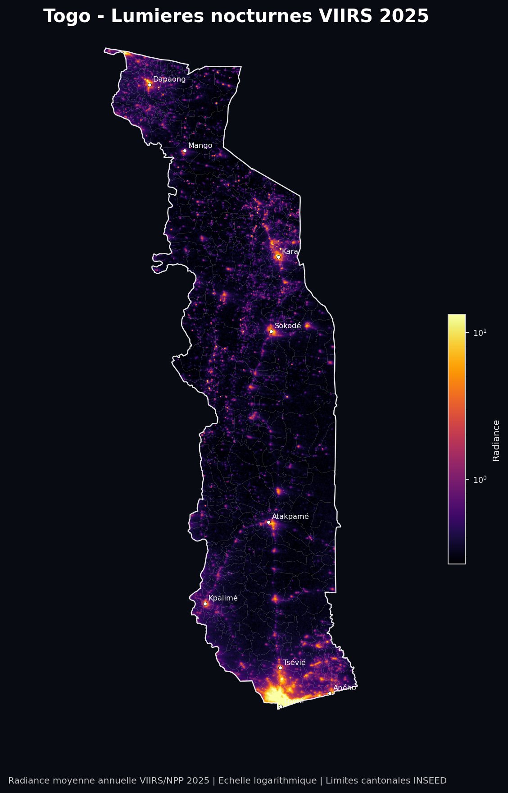
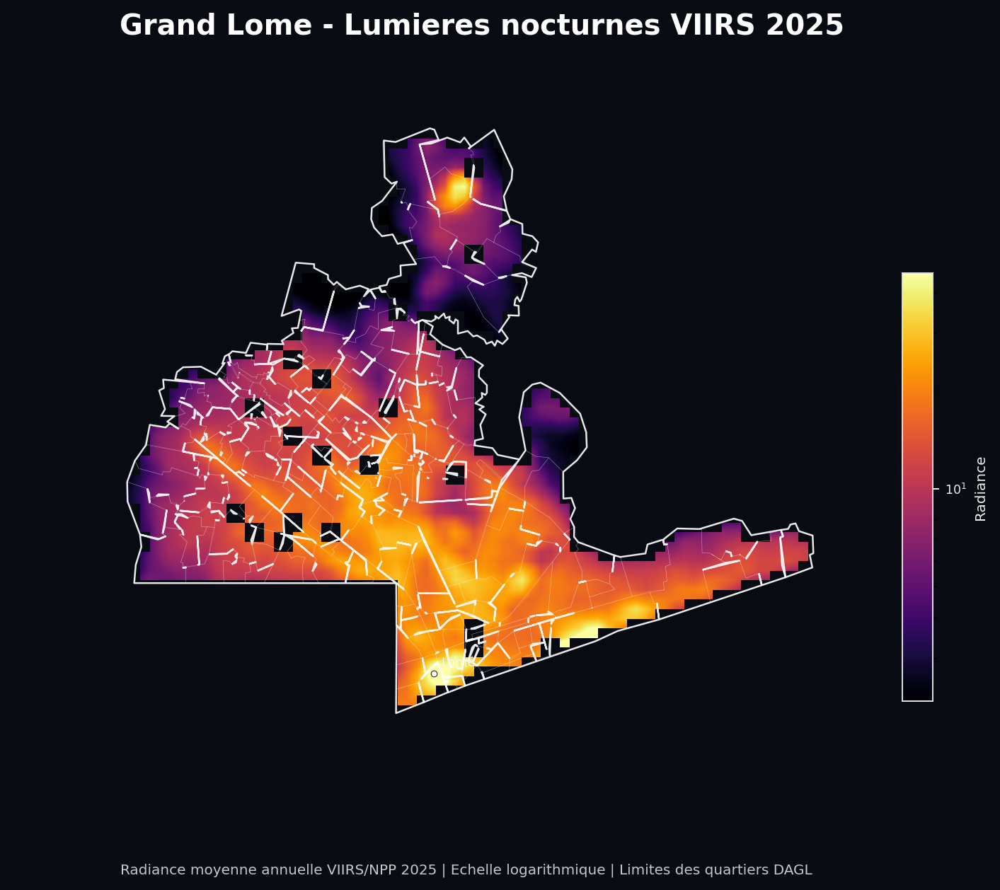
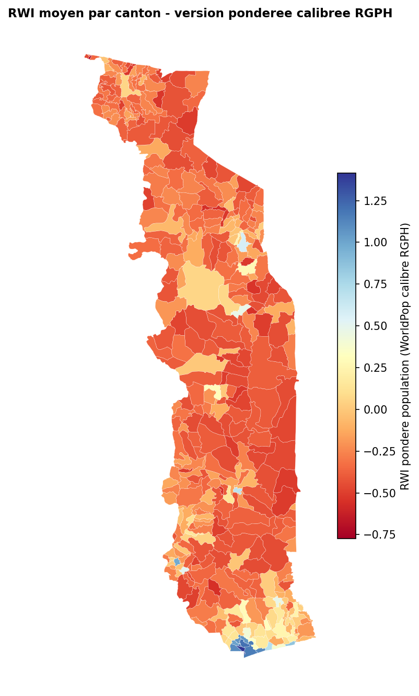
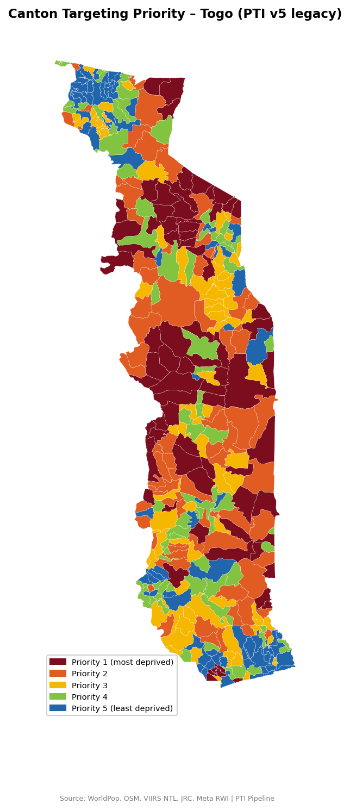
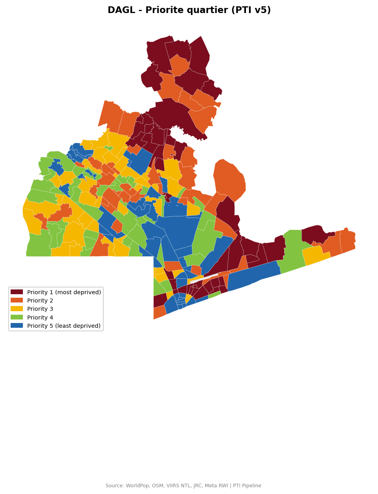
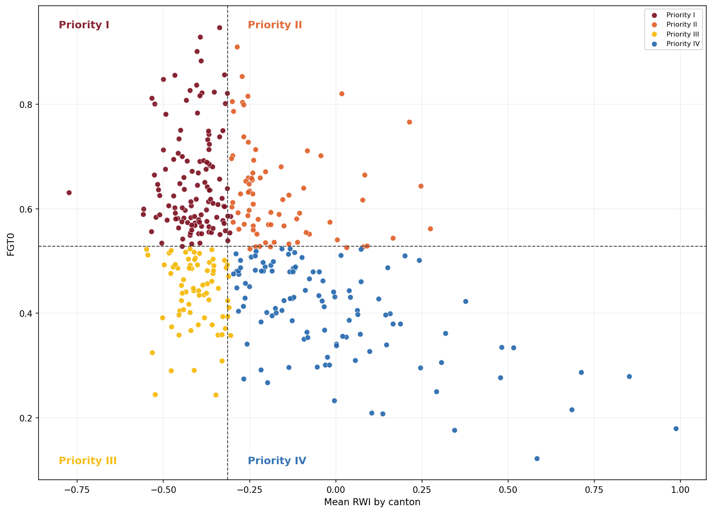

Applied projects at the intersection of data, development, and public policy.

My time at the World Bank introduced me to the art (and occasional frustration) of targeting: getting the right resources to the right households, in the right place. Working with tools like the PMT, SWIFT, SWIFT-Plus, PTI, and the Relative Wealth Index convinced me that better spatial targeting is not just a technical problem, but a policy imperative. Since then, I have been somewhat obsessed with building sharper, more actionable tools at the intersection of data, geospatial analysis, and social policy. What you find here are a few of those experiments, the kind that tend to happen when an economist has free time and a laptop.

```{=html}
<div style="margin-top:2rem;">

  <!-- ── PROJECT 1 ─────────────────────────────────────────── -->
  <div style="margin-bottom:3rem;">

    <h2 style="font-size:1.5rem; font-weight:700; color:#002366; margin-bottom:0.3rem;">
      Spatial Targeting Tool for Togo
    </h2>
    <p style="color:#666; font-size:0.88rem; margin-bottom:0.8rem;">
      Spatial Analysis &nbsp;·&nbsp; Public Policy &nbsp;·&nbsp; 2025
    </p>
    <p style="color:#333; font-size:0.93rem; margin-bottom:1.2rem; line-height:1.7;">
      A composite priority index combining census, satellite, and geospatial data to rank cantons and neighborhoods in Togo by poverty and vulnerability, supporting evidence-based allocation of social and infrastructure investments. A more comprehensive version of the index (v5) is currently in progress and will be available shortly.
    </p>

    <div style="display:flex; flex-direction:column; gap:0.5rem;">

      <!-- Methodology -->
      <details style="border-radius:6px; overflow:hidden;">
        <summary style="list-style:none; cursor:pointer; background:#002366; color:white; font-weight:600; font-size:0.95rem; padding:0.75rem 1.2rem; display:flex; justify-content:space-between; align-items:center; user-select:none;">
          Methodology <span style="font-size:0.8rem; opacity:0.8;">▼</span>
        </summary>
        <div style="padding:1.2rem 1.5rem; background:#f5f8ff; color:#333; line-height:1.8; font-size:0.93rem;">
          <p>The PTI v4 is a composite territorial prioritization index designed to identify the cantons and neighborhoods facing the most severe and overlapping forms of vulnerability. The underlying premise is that a territory should be deemed more deserving of intervention when it simultaneously exhibits poor access to essential services, elevated exposure to environmental hazards, physical isolation, and weak signals of economic activity.</p>
          <p>The index aggregates five dimensions: <strong>travel time to the nearest school</strong>, <strong>travel time to the nearest health facility</strong>, <strong>flood exposure</strong>, <strong>road density</strong>, and <strong>nighttime light intensity</strong>. Travel times to schools and health centers serve as proxies for access to basic social services. Flood exposure captures an environmental constraint that compounds household vulnerability. Road density proxies physical connectivity and territorial integration. Nighttime light intensity is used as an indirect indicator of local economic activity and development levels.</p>
          <p>Prior to aggregation, each indicator is standardized to ensure comparability across dimensions with heterogeneous units and scales. The index is then constructed through a simple additive specification. Indicators associated with more favorable territorial conditions (road density and nighttime lights) enter with a negative sign, so that higher index values consistently correspond to greater relative deprivation. Conversely, indicators reflecting disadvantage (travel times and flood exposure) contribute positively to the index.</p>
          <p style="margin-bottom:0;">The PTI v4 can therefore be interpreted as a synthetic measure of relative territorial disadvantage: the higher the score, the higher the priority assigned to the unit. Once computed, the index is discretized into priority groups (typically quintiles) to facilitate cartographic visualization and cross-territorial comparison.</p>
        </div>
      </details>

      <!-- Inputs -->
      <details style="border-radius:6px; overflow:hidden;">
        <summary style="list-style:none; cursor:pointer; background:#002366; color:white; font-weight:600; font-size:0.95rem; padding:0.75rem 1.2rem; display:flex; justify-content:space-between; align-items:center; user-select:none;">
          Inputs <span style="font-size:0.8rem; opacity:0.8;">▼</span>
        </summary>
        <div style="padding:1.1rem 1.4rem; background:#f5f8ff;">
          <table style="width:100%; border-collapse:collapse; font-size:0.92rem;">
            <thead>
              <tr style="border-bottom:2px solid #002366;">
                <th style="text-align:left; padding:0.4rem 0.6rem; color:#002366;">Indicator</th>
                <th style="text-align:left; padding:0.4rem 0.6rem; color:#002366;">Source</th>
              </tr>
            </thead>
            <tbody>
              <tr style="border-bottom:1px solid #dde3f0;"><td style="padding:0.4rem 0.6rem;">Population & poverty</td><td style="padding:0.4rem 0.6rem; color:#555;">RGPH 2022, EHCVM <span style="color:#002366; font-size:0.8rem;">†</span></td></tr>
              <tr style="border-bottom:1px solid #dde3f0;"><td style="padding:0.4rem 0.6rem;">Canton boundaries</td><td style="padding:0.4rem 0.6rem; color:#555;">Shapefile canton <span style="color:#002366; font-size:0.8rem;">†</span></td></tr>
              <tr style="border-bottom:1px solid #dde3f0;"><td style="padding:0.4rem 0.6rem;">Nighttime lights</td><td style="padding:0.4rem 0.6rem; color:#555;">NASA VIIRS</td></tr>
              <tr style="border-bottom:1px solid #dde3f0;"><td style="padding:0.4rem 0.6rem;">Relative wealth</td><td style="padding:0.4rem 0.6rem; color:#555;">Meta RWI</td></tr>
              <tr style="border-bottom:1px solid #dde3f0;"><td style="padding:0.4rem 0.6rem;">Service accessibility</td><td style="padding:0.4rem 0.6rem; color:#555;">OpenStreetMap</td></tr>
              <tr style="border-bottom:1px solid #dde3f0;"><td style="padding:0.4rem 0.6rem;">Road network</td><td style="padding:0.4rem 0.6rem; color:#555;">OpenStreetMap</td></tr>
              <tr style="border-bottom:1px solid #dde3f0;"><td style="padding:0.4rem 0.6rem;">Flood risk</td><td style="padding:0.4rem 0.6rem; color:#555;">GFD / FATHOM</td></tr>
              <tr><td style="padding:0.4rem 0.6rem;">Built-up density</td><td style="padding:0.4rem 0.6rem; color:#555;">GHSL</td></tr>
            </tbody>
          </table>
          <p style="margin-top:0.9rem; margin-bottom:0; font-size:0.82rem; color:#666;">
            <span style="color:#002366; font-weight:600;">†</span> Restricted-access data. Requests should be directed to <strong>INSEED-Togo</strong> (Institut National de la Statistique et des Études Économiques et Démographiques).
          </p>
        </div>
      </details>

      <!-- Results -->
      <details style="border-radius:6px; overflow:hidden;">
        <summary style="list-style:none; cursor:pointer; background:#002366; color:white; font-weight:600; font-size:0.95rem; padding:0.75rem 1.2rem; display:flex; justify-content:space-between; align-items:center; user-select:none;">
          Results <span style="font-size:0.8rem; opacity:0.8;">▼</span>
        </summary>
        <div style="padding:1.4rem; background:#f5f8ff; display:flex; flex-direction:column; gap:2.5rem;">

          <!-- Nighttime Lights -->
          <div>
            <p style="font-weight:600; color:#002366; margin-bottom:0.8rem; font-size:0.95rem;">Nighttime Light Intensity: Togo & Greater Lomé (VIIRS 2025)</p>
            <div style="display:flex; gap:1rem; flex-wrap:wrap;">
              <div style="flex:1; min-width:200px;">
                
                <p style="font-size:0.8rem; color:#555; margin-top:0.5rem; line-height:1.5;">Annual mean VIIRS/NPP radiance (log scale) at the national level. Light concentration is driven by Lomé and a handful of secondary cities; most northern cantons register near-zero luminosity, signaling acute infrastructure deficits. Canton boundaries: INSEED-Togo.</p>
              </div>
              <div style="flex:1; min-width:200px;">
                
                <p style="font-size:0.8rem; color:#555; margin-top:0.5rem; line-height:1.5;">Intra-urban light distribution in Greater Lomé. Despite the city's overall dynamism, significant disparities emerge between the lit commercial core and underserved peripheral neighborhoods. Neighborhood boundaries: DAGL.</p>
              </div>
            </div>
          </div>

          <!-- RWI -->
          <div>
            <p style="font-weight:600; color:#002366; margin-bottom:0.8rem; font-size:0.95rem;">Relative Wealth Index: Canton Level (Meta RWI)</p>
            <div style="max-width:340px;">
              
              <p style="font-size:0.8rem; color:#555; margin-top:0.5rem; line-height:1.5;">Population-weighted mean Relative Wealth Index (Meta) per canton, calibrated against the RGPH 2022. Deep red tones indicate low relative asset wealth, concentrated in the Savanes and central Kara regions. Blue tones reflect comparatively wealthier cantons, predominantly in the south. Canton names: INSEED-Togo.</p>
            </div>
          </div>

          <!-- PTI Maps -->
          <div>
            <p style="font-weight:600; color:#002366; margin-bottom:0.8rem; font-size:0.95rem;">Priority Targeting Index (PTI v5): National & Greater Lomé</p>
            <div style="display:flex; gap:1rem; flex-wrap:wrap;">
              <div style="flex:1; min-width:200px;">
                
                <p style="font-size:0.8rem; color:#555; margin-top:0.5rem; line-height:1.5;">National canton-level priority classification into five tiers (PTI v5). Priority 1 cantons (the most deprived) are concentrated in the Savanes and Kara regions, where low wealth, limited service access, and infrastructure gaps overlap. Canton names: INSEED-Togo.</p>
              </div>
              <div style="flex:1; min-width:200px;">
                
                <p style="font-size:0.8rem; color:#555; margin-top:0.5rem; line-height:1.5;">Neighborhood-level priority classification for Greater Lomé (PTI v5). The map reveals marked within-city heterogeneity: peri-urban and northern periphery neighborhoods concentrate the highest deprivation levels, while central and coastal areas rank among the least deprived. Neighborhood names: DAGL.</p>
              </div>
            </div>
          </div>

          <!-- Quadrant -->
          <div>
            <p style="font-weight:600; color:#002366; margin-bottom:0.8rem; font-size:0.95rem;">Poverty–Wealth Quadrant Analysis: Cantons (excl. Lomé)</p>
            
            <p style="font-size:0.8rem; color:#555; margin-top:0.5rem; line-height:1.5;">Each canton is positioned along two dimensions: the poverty headcount ratio FGT(0) on the vertical axis and the mean Relative Wealth Index on the horizontal axis. The four quadrants define a targeting typology. Priority I cantons (high poverty, low wealth) represent the most acute cases of combined deprivation and are primary targets for social protection interventions. For canton-level identification on this chart, please <a href="mailto:kodjo.aklobessi@umontreal.ca" style="color:#002366;">contact the author</a>.</p>
          </div>

        </div>
      </details>

    </div>
  </div>
  <!-- ── END PROJECT 1 ──────────────────────────────────────── -->

  <!-- ── PROJECT 2 ─────────────────────────────────────────── -->
  <div style="margin-bottom:3rem;">

    <h2 style="font-size:1.5rem; font-weight:700; color:#002366; margin-bottom:0.3rem;">
      Crop Yield Prediction and Optimal Cultivation Mapping in Togo
    </h2>
    <p style="color:#666; font-size:0.88rem; margin-bottom:0.8rem;">
      Agricultural Economics &nbsp;·&nbsp; Remote Sensing &nbsp;·&nbsp; Forthcoming
    </p>
    <p style="color:#333; font-size:0.93rem; margin-bottom:1.2rem; line-height:1.7;">
      What should farmers grow, and where, to maximize yields? This project develops a crop-specific yield prediction tool for Togo by integrating agricultural survey data (EHCVM, national census) with satellite imagery. The goal is to produce actionable, spatially explicit recommendations that can inform agricultural extension services and food security policy.
    </p>

    <div style="display:flex; flex-direction:column; gap:0.5rem;">

      <!-- Methodology -->
      <details style="border-radius:6px; overflow:hidden;">
        <summary style="list-style:none; cursor:pointer; background:#002366; color:white; font-weight:600; font-size:0.95rem; padding:0.75rem 1.2rem; display:flex; justify-content:space-between; align-items:center; user-select:none;">
          Methodology <span style="font-size:0.8rem; opacity:0.8;">▼</span>
        </summary>
        <div style="padding:1.2rem 1.5rem; background:#f5f8ff; color:#888; font-style:italic; font-size:0.93rem;">
          Forthcoming.
        </div>
      </details>

      <!-- Inputs -->
      <details style="border-radius:6px; overflow:hidden;">
        <summary style="list-style:none; cursor:pointer; background:#002366; color:white; font-weight:600; font-size:0.95rem; padding:0.75rem 1.2rem; display:flex; justify-content:space-between; align-items:center; user-select:none;">
          Inputs <span style="font-size:0.8rem; opacity:0.8;">▼</span>
        </summary>
        <div style="padding:1.2rem 1.5rem; background:#f5f8ff; color:#888; font-style:italic; font-size:0.93rem;">
          Forthcoming.
        </div>
      </details>

      <!-- Results -->
      <details style="border-radius:6px; overflow:hidden;">
        <summary style="list-style:none; cursor:pointer; background:#002366; color:white; font-weight:600; font-size:0.95rem; padding:0.75rem 1.2rem; display:flex; justify-content:space-between; align-items:center; user-select:none;">
          Results <span style="font-size:0.8rem; opacity:0.8;">▼</span>
        </summary>
        <div style="padding:1.2rem 1.5rem; background:#f5f8ff; color:#888; font-style:italic; font-size:0.93rem;">
          Forthcoming.
        </div>
      </details>

    </div>
  </div>
  <!-- ── END PROJECT 2 ──────────────────────────────────────── -->

</div>
```
